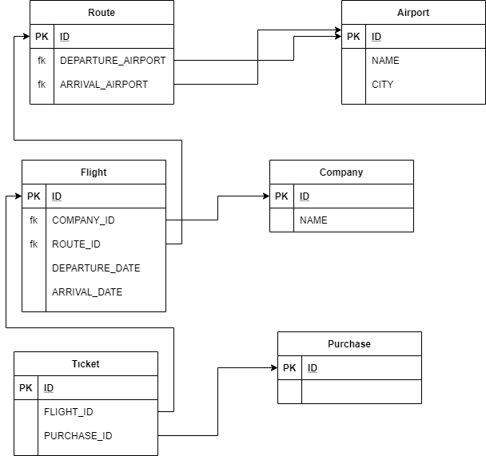

# Flight Simulator


i used swagger-ui to document the controllers, so you can just go to localhost:8080/swagger-ui.html to see the endpoints and trigger them with example values.
building and running is straightforward cause of the spring-boot:
you can just to into to root dir of project and create a jar with
```sh
$ mvn package
```
and then run the application with 
```sh
$ java -jar ./target/flight-simulator-1.0-SNAPSHOT.jar
```

Here's my relation schema:


Since i'm using embedded h2 db, i changed the h2 property to in-memory db , so you can run the app, but if you like to persist your data , just change the jpa.url in the application.yml 


After running the application.
- to purchase a ticket, first you must create a company, then at least two airports
- after tese you need to create a route (requires dest and arrival airports) 
- then, a flight that relates to a company and a route.
- now, you can make a purchase
- ps: you should not create tickets via ticket-controller
